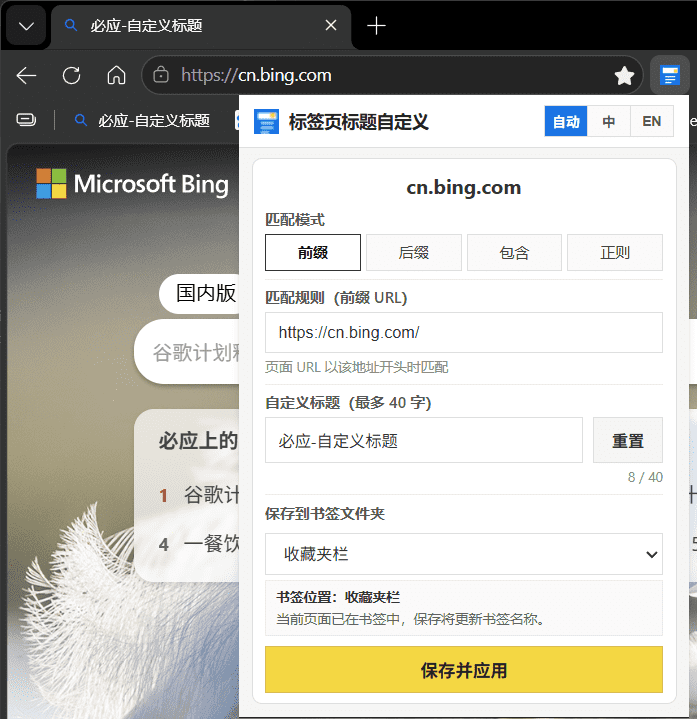
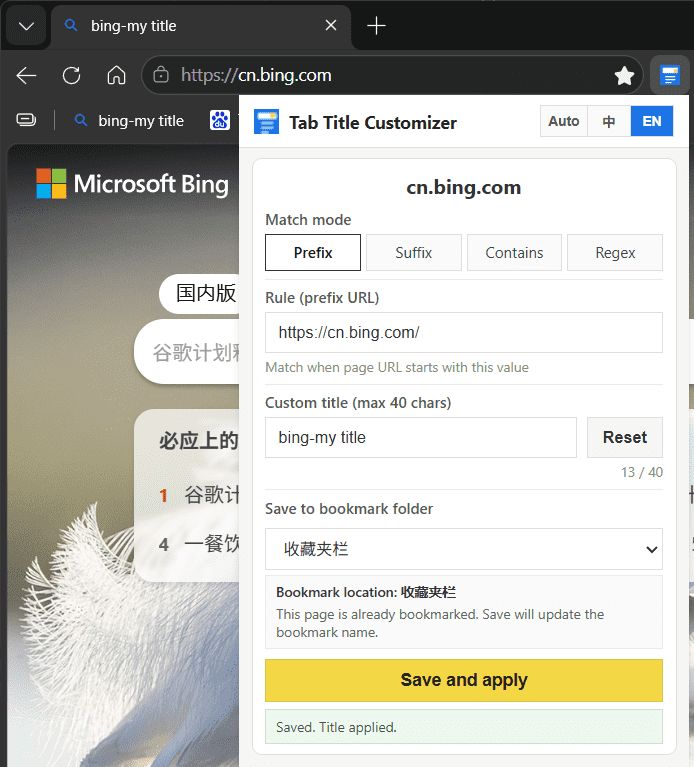

# 标签页标题自定义 / Tab Title Customizer

[](extension/manifest.json)
[](https://www.google.com/chrome/)
[](https://www.microsoft.com/edge)

按 URL 规则自动替换浏览器标签页标题，支持手动保存映射与书签同步。  
Automatically replace browser tab titles by URL rules, with manual mapping and bookmark sync.

Compatible with **Google Chrome** and **Microsoft Edge** (Chromium, Manifest V3).

---

## screenshot



## 中文

### 功能特性

- **自动改标题**：页面加载完成后，按规则自动替换标签页标题；刷新或重启浏览器后仍生效
- **查找优先级**：`chrome.storage.local` 映射 → 书签收藏夹兜底
- **四种匹配模式**：前缀、后缀、包含、正则；多条命中时取 **最长规则** 优先
- **手动保存**：点击扩展图标，在 Popup 中编辑规则与自定义标题（最多 40 字）并立即应用
- **书签同步**：保存时若页面已在书签中则更新名称；否则加入所选文件夹（支持层级选择）
- **重置标题**：一键恢复页面原始标题；若缓存标题与当前相同，会尝试 HTML 解析或刷新页面重新捕获
- **中英国际化**：跟随浏览器语言自动切换；Popup 右上角可手动选择「自动 / 中 / EN」
- **持久锁定**：通过 MutationObserver 防止站点脚本改回标题

### 匹配示例

| 规则 | 模式 | 页面 URL | 结果 |
|------|------|----------|------|
| `https://example.com/library/2010` | 前缀 | `https://example.com/library/20101001` | 匹配 |
| `https://example.com/a` | 前缀 | `https://example.com/b` | 不匹配 |
| `/index.html` | 后缀 | `https://site.com/docs/index.html` | 匹配 |
| `library/2010` | 包含 | `https://site.com/library/2010/page` | 匹配 |

### 项目结构

```
label-title-modif/
├── extension/              # 扩展源码（加载此目录）
│   ├── manifest.json
│   ├── background.js       # Service Worker
│   ├── content-capture.js  # 页面最早阶段捕获原始标题
│   ├── content.js          # 注入页面修改标题
│   ├── popup.html/js/css   # Popup 界面
│   ├── lib/matcher.js      # 规则匹配逻辑
│   └── icons/
├── label-title-modif-extension.zip  # npm run pack 生成
└── README.md
```

### 安装（开发者模式）

1. 打开 Chrome / Edge，访问 `chrome://extensions`
2. 开启 **开发者模式**
3. 点击 **加载已解压的扩展程序**
4. 选择本仓库中的 [`extension`](extension) 目录

### 打包

```powershell
npm run pack
```

将在项目根目录生成 `label-title-modif-extension.zip`，可用于 Chrome Web Store / Edge Add-ons 提交。

### 使用方法

1. 打开任意 http/https 页面
2. 点击工具栏中的扩展图标
3. 选择匹配模式，填写规则 URL/文本与自定义标题
4. 点击 **保存并应用**
5. 需要恢复原始标题时，点击 **重置**

### 权限说明

| 权限 | 用途 |
|------|------|
| `storage` | 本地保存 URL-标题映射 |
| `bookmarks` | 读取书签作为映射兜底；保存时同步书签 |
| `tabs` | 监听页面加载完成并下发标题 |
| `<all_urls>` | 向各站点注入 content script 以修改标题 |

> 本扩展 **不采集、不上传** 任何用户数据，所有映射仅保存在浏览器本地。

### 隐私

- 无远程服务器、无账号、无分析追踪
- 数据存储于 `chrome.storage.local` 与 `chrome.storage.session`
- 书签仅在本机读写，用于标题映射与保存

---

## English

### Features

- **Auto title replacement**: Applies custom tab titles when a page finishes loading; persists across refresh and browser restart
- **Lookup order**: `chrome.storage.local` mappings first, then bookmarks as fallback
- **Four match modes**: prefix, suffix, contains, regex; **longest matching rule** wins when multiple rules apply
- **Manual save**: Open the popup to edit rules and custom titles (max 40 characters) and apply instantly
- **Bookmark sync**: Updates bookmark name if the page is already bookmarked; otherwise adds it to the selected folder
- **Reset title**: Restores the original page title; if cached title equals current title, tries HTML parsing or page reload to re-capture
- **i18n (EN / 中文)**: Follows browser language by default; switch manually via **Auto / 中 / EN** in the popup header
- **Title lock**: Uses MutationObserver to prevent sites from overwriting the custom title

### Match examples

| Rule | Mode | Page URL | Result |
|------|------|----------|--------|
| `https://example.com/library/2010` | prefix | `https://example.com/library/20101001` | match |
| `https://example.com/a` | prefix | `https://example.com/b` | no match |
| `/index.html` | suffix | `https://site.com/docs/index.html` | match |
| `library/2010` | contains | `https://site.com/library/2010/page` | match |

### Project structure

```
label-title-modif/
├── extension/              # Extension source (load this folder)
│   ├── manifest.json
│   ├── background.js       # Service worker
│   ├── content-capture.js  # Captures original title at document_start
│   ├── content.js          # Applies title changes in the page
│   ├── popup.html/js/css   # Popup UI
│   ├── lib/matcher.js      # Rule matching logic
│   └── icons/
├── label-title-modif-extension.zip  # Generated by npm run pack
└── README.md
```

### Install (developer mode)

1. Open Chrome / Edge and go to `chrome://extensions`
2. Enable **Developer mode**
3. Click **Load unpacked**
4. Select the [`extension`](extension) folder in this repository

### Package

```powershell
npm run pack
```

Generates `label-title-modif-extension.zip` in the project root for Chrome Web Store / Edge Add-ons submission.

### Usage

1. Open any http/https page
2. Click the extension icon in the toolbar
3. Choose a match mode, enter the rule and custom title
4. Click **Save and apply**
5. Click **Reset** to restore the original page title

### Permissions

| Permission | Purpose |
|------------|---------|
| `storage` | Store URL-to-title mappings locally |
| `bookmarks` | Read bookmarks as fallback; sync on save |
| `tabs` | Listen for page load and send title updates |
| `<all_urls>` | Inject content scripts to modify page titles |

> This extension does **not** collect or upload user data. All mappings stay on your device.

### Privacy

- No remote servers, accounts, or analytics
- Data stored in `chrome.storage.local` and `chrome.storage.session`
- Bookmarks are read/written locally only

---

## License

Private project. All rights reserved unless otherwise specified.
